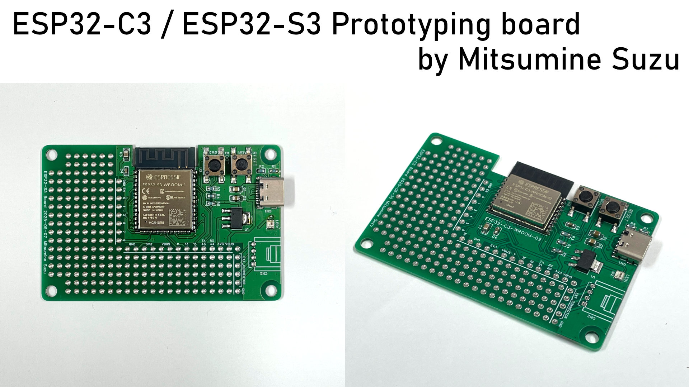
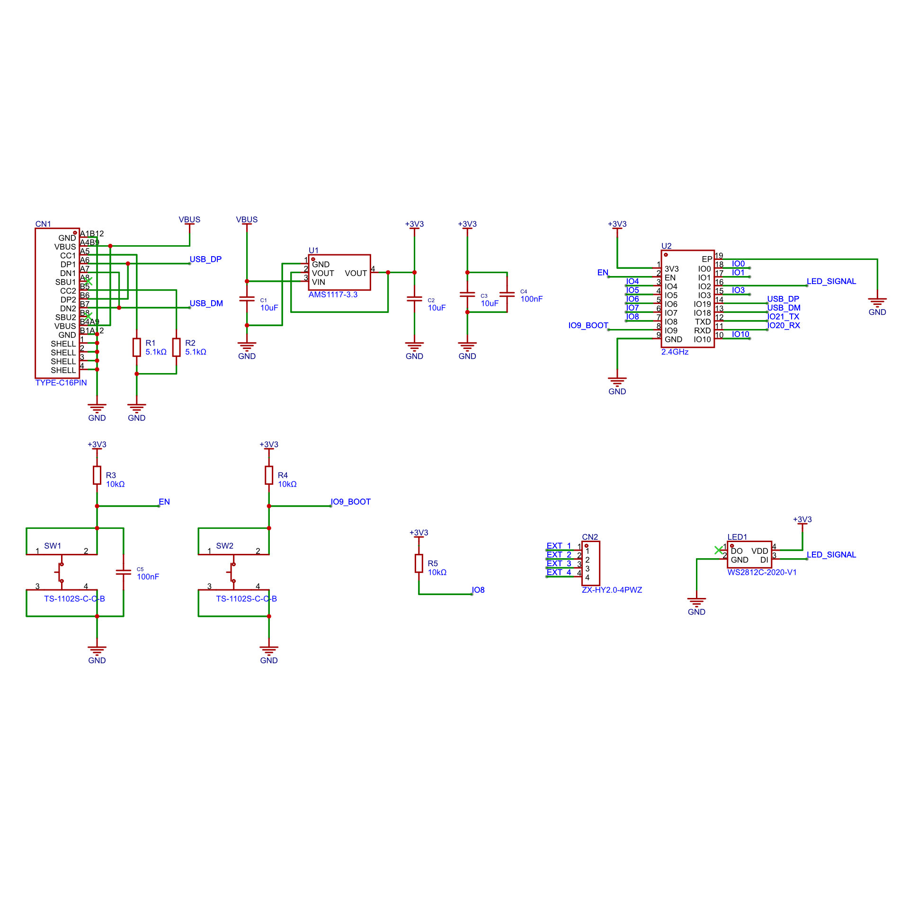
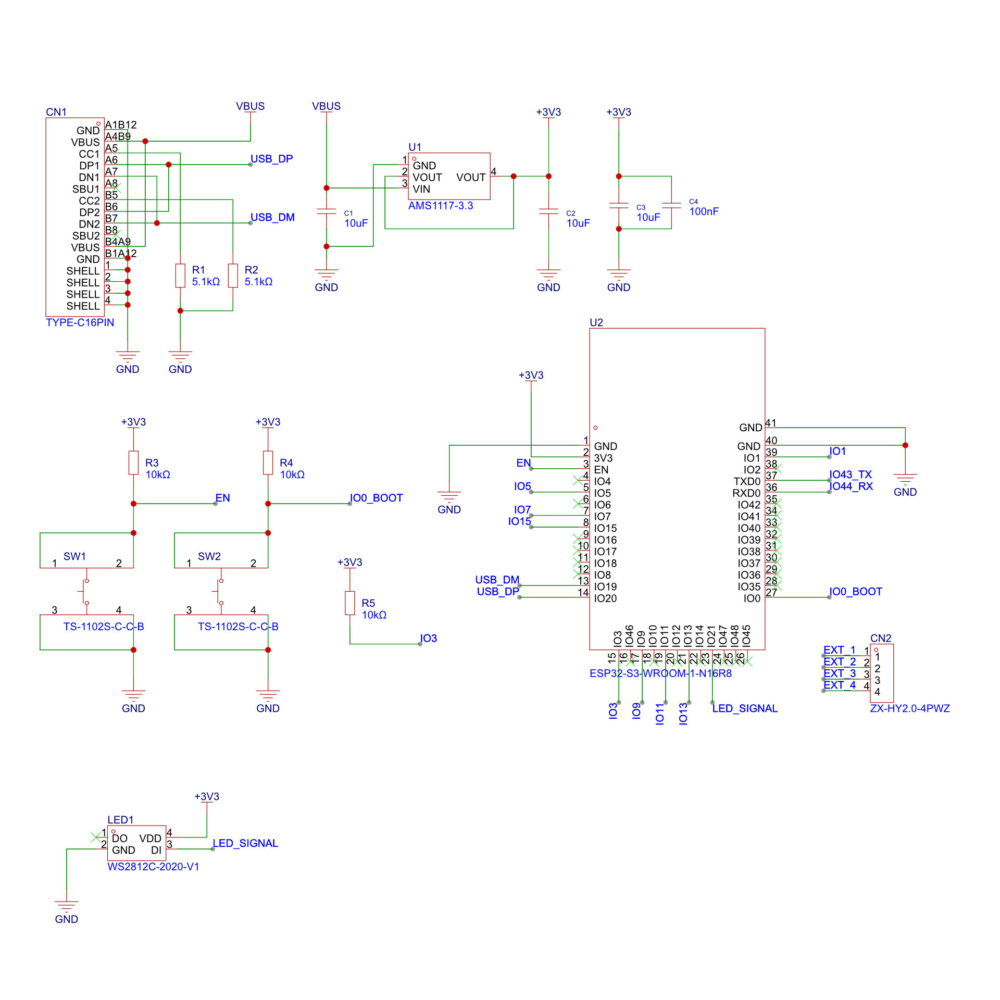

# ESP32-C3/S3 プロトタイピング基板 / ESP32-C3/S3 Prototyping board

ESP32-C3やESP32-S3を搭載した、プロトタイピングや一品物の製作に便利な基板です。WROOMモジュールの動作に必要な回路とユニバーサル基板エリアがセットになっているため、マイコンと周辺回路が1枚の基板にスマートに収められます。

The prototyping board with ESP32-C3 or ESP32-S3.

製作 / Created by： 三峰スズ (Mitsumine Suzu)

## ESP32-C3 プロトタイプ基板

**回路図**

**マニュアル** [Page 1](ESP32C3_Manual_P1.jpg), [Page 2](ESP32C3_Manual_P2.jpg)

## ESP32-S3 プロトタイプ基板

**回路図**

**マニュアル** [Page 1](ESP32S3_Manual_P1.jpg), [Page 2](ESP32S3_Manual_P2.jpg)

## LICENSE

回路図やマニュアル / Schematics and manuals: CC-BY SA 4.0

サンプルプログラム / Sample program: MIT License
